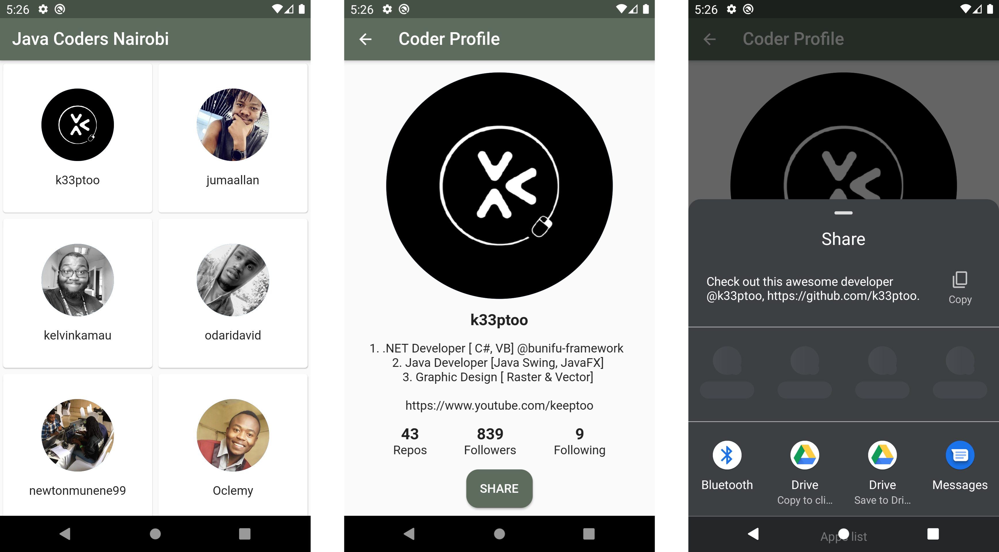

# Java Coders Nairobi

A mobile app (Android and iOS) for viewing the top Java developers on Github from Nairobi. Data is pulled from the Github API.



## How to Run
**NOTE:** Before proceeding, ensure to have [flutter](https://flutter.dev/docs/get-started/install) installed and configured.

### 1. Clone the project

```
git clone https://github.com/ongebo/java-coders-nairobi-flutter.git
```

### 2. Set up a physical device or emulator

For Android, follow [this](https://developer.android.com/training/basics/firstapp/running-app#RealDevice) guide to connect a physical device or an emulator.

### 3. Run the app

Navigate to the cloned project and execute this command from the terminal:
```
flutter run
```
